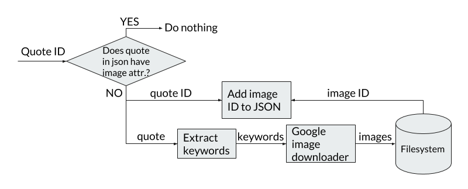
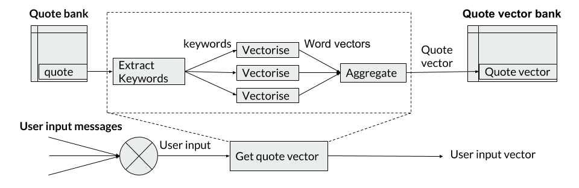
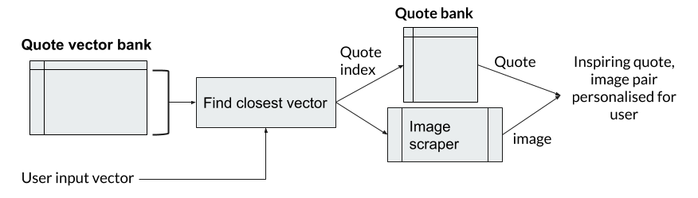

# Quote-Therapist

Quote-Therapist is an AI chatbot providing personalised, inspirational and nuanced content regarding user proposed problems in natural language.

**Inspirational Content:** Web-harvested quotes and images

**User data collected for personalisation:** User conversation with modified Eliza chatbot

**Personalised, Inspirational Content:** Quotes and Images filtered using the user data

# App infrastructure

## Flask
The app was built using the flask framework (/app/main.py)

## Front-end
The front end HTML and JavaScript can be found in (/app/templates/session.html)

## Back-end 

### Web-Harvesting scripts

#### Quote scrapers

Three scrapers (/app/scrapers/) were built to harvest quotes from the websites; *wiseoldsayings.com*, *famousquotesandauthors.com* and *quoteland.com*.

The scrapers store the quotes in JSON format (/app/quotes/).

#### Image scraper

The image scraper (/app/scrapers/scraper_images.py) finds images for each quote and stores them in (/app/static/images/). 
Before scraping the function checks if the quote already has images downloaded (by checking for an image attribute in the quote JSON).

If not present the quote is decomposed into keywords which are used to query google images with safe search enabled.
The scraper stores the images and adds the image location as an image attribute in the quote JSON.

### Collecting user data

User data is collected to personalise the harvested quotes and images. (data is only stored as long as the connection is open, and deleted after every quote, image pair is displayed on-screen.

The user has a short conversation with an Eliza chatbot [1] which we modified to be more questioning and to accept 'double sentences'. 
The user messages are then used to filter the inspirational content for the user. 
ie. the inspirational content will be relevant to the conversation and therefore to the user's state of mind.

Besides our modified Eliza bot (/app/eliza.py) originally by Jez Higgins [2].
We tried a faithful python porting of the original MIT Eliza [1],[3] but it performed poorly for getting the user to elaborate on topics.

### Filtering the inspirational content

Functions were built to convert quotes to vector representations (/app/quote_mappers/), (app/quote_functions/get_keywords).

The quotes and user input were first changed to vector representations. (figure 2)
The user input was then compared to the quote vectors to find the closest quote. 
This quote and one of its images is then returned to the user (figure 3).

#### Notes
The word vectors are the pre-trained embeddings from GloVe by Stanford. [4] (/app/glove/)
The document vector bank is actually created in advance, unless it has been deleted (/app/models/docvectors.p)

[1] https://web.stanford.edu/class/linguist238/p36-weizenabaum.pdf 
[2] https://github.com/jezhiggins/eliza.py
[3] https://github.com/wadetb/eliza
[4] https://nlp.stanford.edu/pubs/glove.pdf

